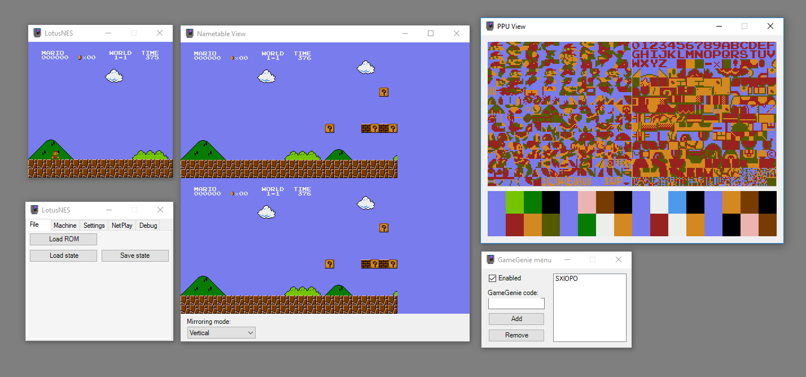

# LotusNES 
## What is this?
This is a fairly feature complete NES emulator written in C# mainly as a learning project. I would estimate that it runs about 80-90% of the NES library. 

Here, have a screenshot:

## How do I use it?

You can either get the latest build off AppVeyor with [this link](https://ci.appveyor.com/project/pema99/lotusnes/build/artifacts) or build the project yourself.

Build with Visual Studio 2017, run the LotusNES project. If you want to use NetPlay one player becomes the host and the other runs the LotusNES.NetPlayClient project.
If you are on OSX or Linux you will need to run the emulator through Mono, but it should be functional.

## Implemented mappers
- NROM
- MM1
- MMC3
- MMC6 (Startropics 1 & 2)
- Mapper 11 (Color Dreams / Wisdom Tree)
- UxROM
- GxROM
- CNROM
- AxROM

## Features
- Supports most of the NES library
- A GUI for interacting with the emulator
- Pretty solid CPU and PPU emulation
- Pretty non-solid APU emulation
- Some neat debugging tools
- NetPlay, play with friends
- Savestates
- Configurable emulation speed with a turbo mode
- Pausing
- Configurable resolution and volume
- Gamepad support
- Can run ROMS with incorrect iNES headers by using SHA1 checksums

## Controls
A | Select
S | Start
Z | Button A
X | Button B
Arrow Keys | DPad, duh
Gamepads are also supported.

## Why?
Because emulation is cool

## (Insert other emulator) is faster and/or better
Yes.

## What's with the name?
My given name means Lotus in tibetan, also I have no imagination.
